<!-- ✦ you read source code. of course you do. control is illusion. ✦ -->

## ⚡ Featured Builds

<table>
<tr>
<td></td>
<td></td>
</tr>
<tr>
<td></td>
<td></td>
</tr>
<tr>
<td></td>
<td></td>
</tr>
</table>

## 📊 Signals

<picture>
  <source media="(prefers-color-scheme: dark)" srcset="https://raw.githubusercontent.com/tathagat22/tathagat22/output/github-snake-dark.svg" />
  
</picture>

  

